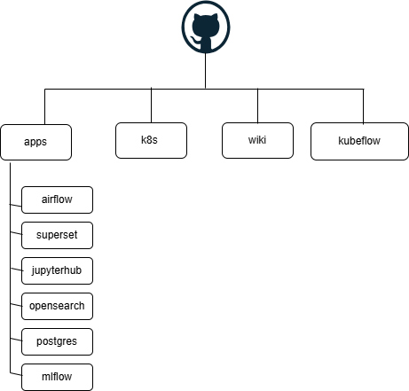

# Avant Propos
Dans cette partie nous trouvons toute la documentation du projet:
- Cadre du projet
- règle de fonctionement
- mise à jour
- incidents
- ...
# organisation de l'équipe
Nous avons convenu que le projet sera divisé sur 3 équipe:
- K8s: se charge du déploiment du cluster k8s et de le maintenir ainsi que les ressources correspendantes (doc, code, ...).
  - membres:
    - Oussema
    - Chourouk
- superset: se charge du définition et déploiement des ressources superset sur k8s et bien evidement leur maintient (code, doc, ...).
  - membres:
    - chourouk
- jupyterhub: se charge du définition et déploiement des ressources jupyterhub sur k8s et bien evidement leur maintient (code, doc, ...).
  - membres
    - Chayma lamouchi
    - Lemjid maysa
- airflow: se charge du définition et déploiement des ressources airflow sur k8s et bien evidement leur maintient (code, doc, ...).
  - membres
    - Amine krimi
    - Marouen jawadi
- wokflow: se charge du définition et déploiement des ressources wokflow sur k8s et bien evidement leur maintient (code, doc, ...).
  - membres
    - Nabil ben salem
    - Moutia
- postgres: se charge du définition et déploiement des ressources postgres sur k8s et bien evidement leur maintient (code, doc, ...).
  - membres
    - Oussema nasri
    - Chaima slim
    - Saber smai
- opensearch: se charge du définition et déploiement des ressources opensearch sur k8s et bien evidement leur maintient (code, doc, ...).
  - membres
    - Nesrine ayadi
    - Omar sfaxi
- kubeflow: se charge du définition et déploiement des ressources kubeflow sur k8s et bien evidement leur maintient (code, doc, ...).
  - membres
    - Chaima lamouchi
    - Maysa
ci dessous une première représentation de l'organisation du repo

# CADRE DU PROJET
Ce projet a était initié dans le cadre de la formation de la classe CVV3 de l'university Iteams Tunisia pour l'année 2024.
L'objectif est d'exploiter les compétances aquises dans les autres unités d'apprentissage (DevOps, Ansible, automatisation, ...)
et de les mettre en oeuvre dans un projet pratique.
vous trouver la présentation du projet dans ce docment

[pres_projet](pres_projet.pdf)

# Regle de fonctionnement
Pour garantir le bon fonctionnement et en appliquant quelques best practicies, il était conveu que:
- la branche master est protegée et il ne peut pas y avoir aucun changement sauf à travers un merge de la branche develop.
- la branche develop est egalement pretégée et toute mise à jour passe par un merge des autres branches
- chaque contribiteur doit créer sa propre branche pour avancer sur ces travaux. Une fois fini il fait un merge request sur develop.
- chaque merge request est conditionné par minimum une validation d'une autre personne du projet.
- Pour faciliter la maintenance, les administrateurs du répo sont exenorés de ces règles. Mais il est recommander d'appliquer ces bonnes pratiques dans les travaux quotidien et ne pas les baypasser que pour des raison de maintenance ou résoluton d'incident.

# keep in touch
Pour faciliter la communication autour du projet ces canaux sont disponibles:
- teams: [24-ING CVV3-2 & 3-3](https://teams.microsoft.com/l/team/19%3AD0V1LtmzoJwq4fUDJtGfry6WjIZXAa6RHmziWxLYSl81%40thread.tacv2/conversations?groupId=e7a071ee-61e1-458e-9e1d-8f6f5e6d8f81&tenantId=76965b8b-46f0-455b-9d56-37a500464222)
- slack: [slack_projet_fédérateur](https://join.slack.com/t/projetsiteams/shared_invite/zt-2so1ai8pi-~zOXJIwLxqPIKABGjpNXJA)
